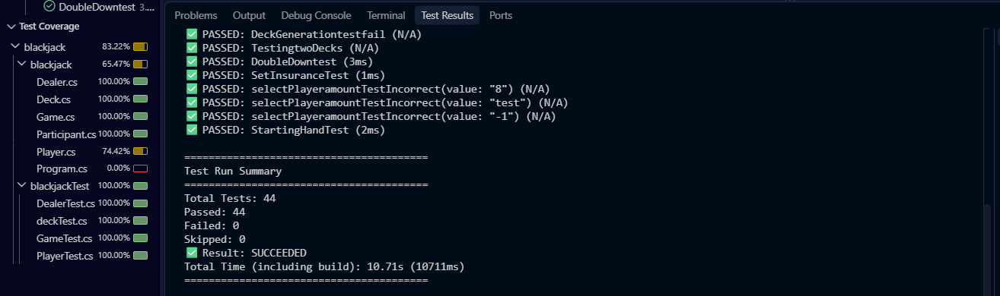
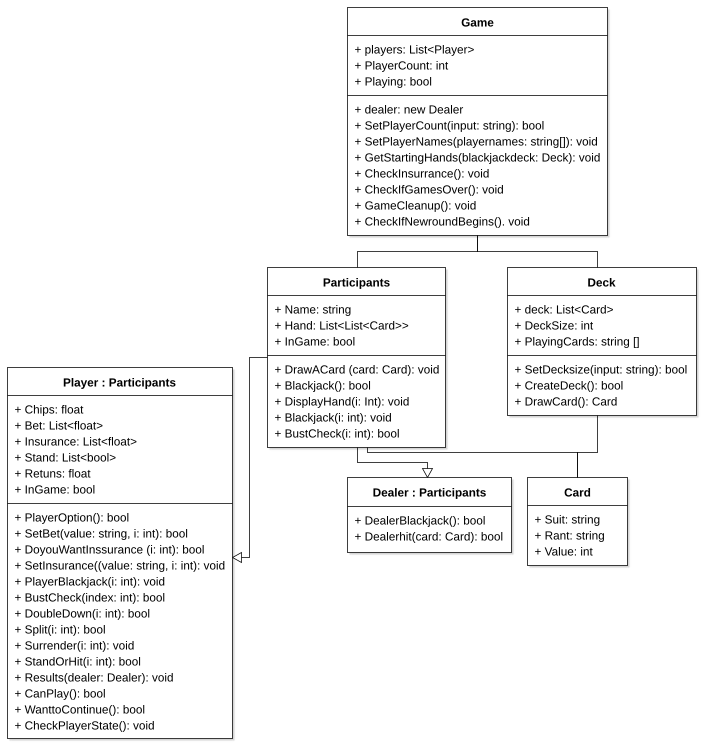

# blackjack
Blackjack project made as part of Specialisterne Academy.

## Project desciption
the project was about developing a functioning blackjack application in a laungaues of our choice.\
Here i chose to make use of C#

### technology used in development
- C#
- .Net
- Xunit
- JetUML

## Development process
- Started out with researching the rules of blackjack
- Prepared a plan for the project
    - Where would I focus my time
    - What functions were  needed in the application
-  Started with the tasks would take up the least amount of time
    -	Created the classes
    -	Created simple functions
    -   tested the code base as I developed it 
- Moved to work on the more complex task
    -  Adjusted classes to work better together
    - Added more complex functions
    - Continued testing
- final finishing touches and adjustments

## Project testing

## UML Diagram
